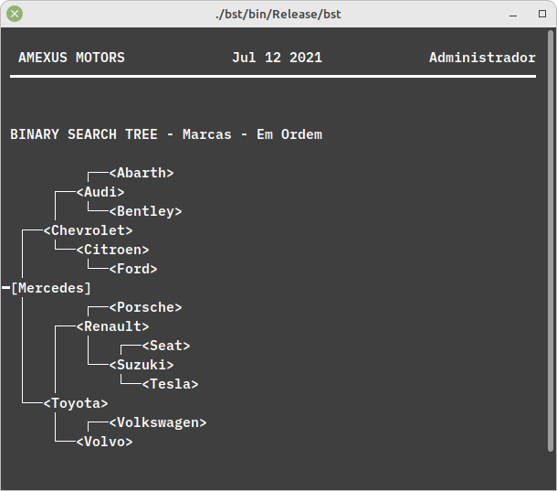

# Gerenciador de loja de Carros V1.3
Trabalho universitário, utilizando árvores binárias de pesquisa.  
  

  
  
O objetivo do trabalho é criar um gerenciador de uma loja de carros que guarda e agrupa os dados em uma árvores binária e uma lista dentro de cada nó da árvore. Assim:

 * A árvore binária de pesquisa guarda as Marcas de Carros,
 * As listas dentro de cada nó da árvore guardam os respetivos modelos.


## Utilização do Programa

**OBS:** Primeiramente, antes da execução do programa aconselhamos usar a janela do terminal (ou command prompt) de forma maximizada para permitir uma melhor experiência!

### Compilação

Para compilar este projeto terá duas opções, primeiro, tente abrir o projeto com o code blocks e compile o projeto, ou segundo utilize um dispositivo GNU/Linux (como o Ubuntu, por exemplo) para compilar o projecto, usando o seguinte comando, na raiz da pasta `bst`:

```bash
make
```

E execute o programa com:

```bash
./main
```

### Utilização

O programa é bastante intuitivo e facilmente entendível.

***Para ter acesso a secção Administrador do programa deve-se introduzir a chave: 1234***.

Inicialmente foram deixadas alguns arquivos de marcas de carros salvos dentro da pasta principal. Esses arquivos devem ser utilizados para experimentar a opção de carregar uma Marca de um arquivo na secção Administrador, o usuário apenas tem de escrever o nome do arquivo que será carregado para a árvore binária.

**Nota:** Embora não estritamente necessário, aconselha-se o uso de Sistemas Operativos baseados em UNIX (Linux, OS X, FreeBSD, etc) para a utilização do programa, devido a menor adaptabilidade do Windows OS com caracteres UTF-8 que foram principalmente usados de forma gráfica, porém ainda assim o programa é bastante apresentável no formato para Windows OS.

